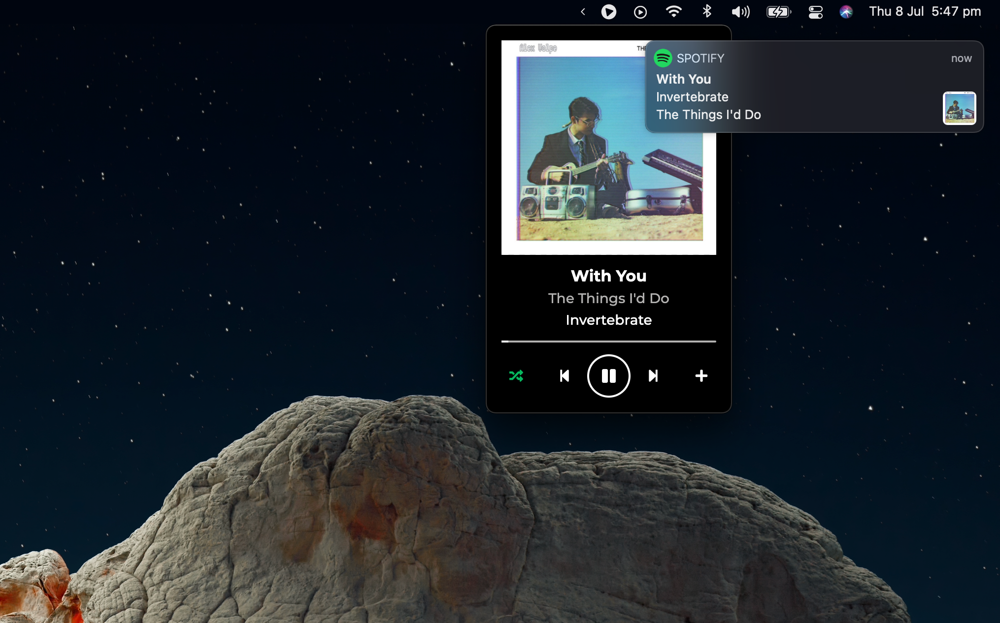
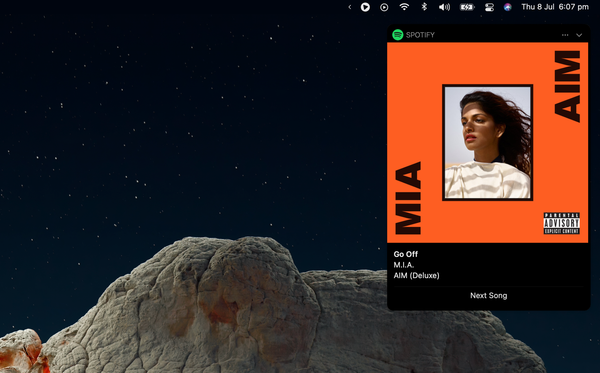
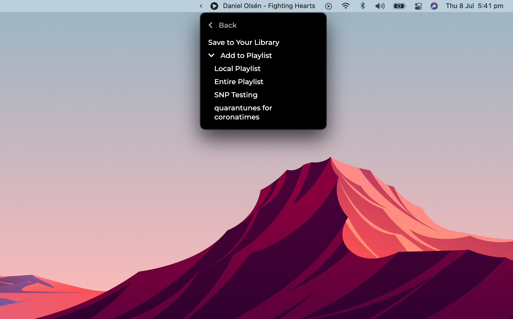

# Now Playing for Spotify

[![Maintainability][maintainability-badge]][maintainability-link]
[][issues]
[![Downloads][github-downloads-badge]][releases]
[![Latest Version][github-latest-release-badge]][latest-release]

Now Playing is a tool for macOS and Spotify used to extend functionality of Spotify Desktop.

## Features

### Mini-Player and Notifications

Now Playing at its heart is a mini-player and native system notifications when running alongside Spotify Desktop!



### Big Sur Expanded Notifications

In Big Sur (and later) you can expand notifications to view the beautiful full-sized album art!



### Song At-A-Glance and Playlist Shortcuts

Optionally, you can see the song you're currently listening to at a glance and quickly add songs to your library!



## Installing

> This application is not yet available in Homebrew Cask. Help us get to 75 stars!

Download the `.dmg` file from the [latest release][latest-release], run it, and move the app to your system's
`Application` folder.

## Local Development

Install dependencies:

```
yarn install
```

You then [must create and register an app][spotify-app-registration] in the Spotify Developer portal. Rename `.env.
json.example` (file in the root of this project) to `.env.json` and update values.

To start the app, run:

```
yarn start
```

## Notes

New maintainers/forkers can see the [DEPLOYMENT.md](DEPLOYMENT.md) file for instructions on distribution.

Neither Apple nor Spotify associate with Now Playing for Spotify. These business names, graphics, style guide, and 
other references are the trademarks of their respective copyright holders.

Thanks to Cindy Xu of Inkling Interactive for designing the tray and app logos.

Thanks to @davicorreiajr's [original project][old-version-repo] on which this hard-fork is derived.

This project uses the [MIT License](LICENSE).

[maintainability-badge]:       https://api.codeclimate.com/v1/badges/87b6080da2e2dce357a2/maintainability
[maintainability-link]:        https://codeclimate.com/github/teaminkling/mac-spotify-np/maintainability
[github-downloads-badge]:      https://img.shields.io/github/downloads/teaminkling/mac-spotify-np/total
[github-latest-release-badge]: https://img.shields.io/github/v/release/teaminkling/mac-spotify-np
[issues]:                      https://github.com/teaminkling/mac-spotify-np/issues
[releases]:                    https://github.com/teaminkling/mac-spotify-np/releases
[latest-release]:              https://github.com/teaminkling/mac-spotify-np/releases/latest
[spotify-app-registration]:    https://developer.spotify.com/documentation/general/guides/app-settings
[old-version-repo]:            https://github.com/davicorreiajr/spotify-now-playing
