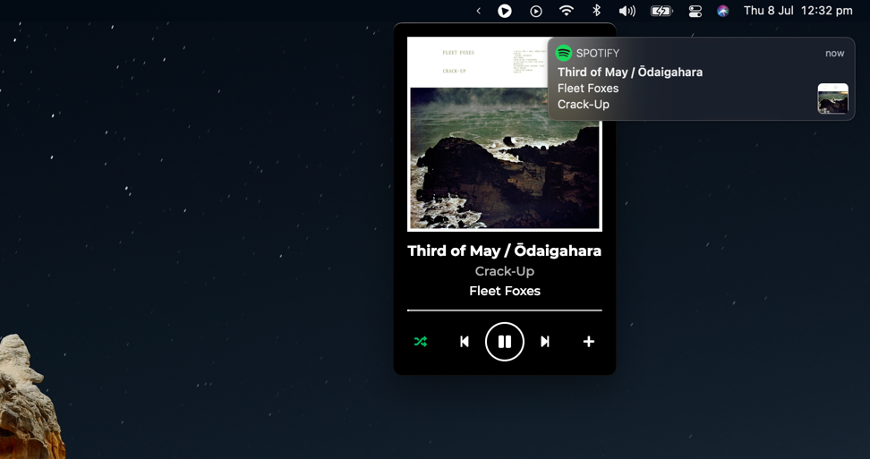

# Now Playing for Spotify

Now Playing is a tool for macOS and Spotify used to extend functionality of Spotify Desktop. It:

- Creates a tray mini-player interface.
- Allows you to add tracks to your library and playlists from the interface.
- (Optionally) displays a notification in Notification Center.
  - Tested to be working on macOS 11.3.1 (Big Sur)!



## Requirements

- macOS 10.15 (Catalina) or higher.

Older versions of macOS may work but are not supported.

## Installing

> This application is not yet available in Homebrew Cask because it does not have the required popularity: 75 stars.

Download the `.dmg` file from the [latest release][latest-release], run it, and move the app to your system's
`Application` folder!

## Local Development

Install dependencies:

```
yarn install
```

You then [must create and register an app][spotify-app-registration] in the Spotify Developer portal. Rename `.env.
json.example` (file in the root of this project) to `.env.json` and update values.

To start the app, run:

```
yarn start
```

## Notes

New maintainers/forkers can see the [DEPLOYMENT.md](DEPLOYMENT.md) file for instructions on distribution.

Neither Apple nor Spotify associate with Now Playing for Spotify. These business names, graphics, style guide, and 
other references are the trademarks of their respective copyright holders.

Thanks to Cindy Xu of Inkling Interactive for designing the tray and app logos.

Thanks to @davicorreiajr's [original project][old-version-repo] on which this hard-fork is derived.

This project uses the [MIT License](LICENSE).

[latest-release]:           https://github.com/teaminkling/mac-spotify-np/releases/latest
[spotify-app-registration]: https://developer.spotify.com/documentation/general/guides/app-settings
[old-version-repo]:         https://github.com/davicorreiajr/spotify-now-playing
